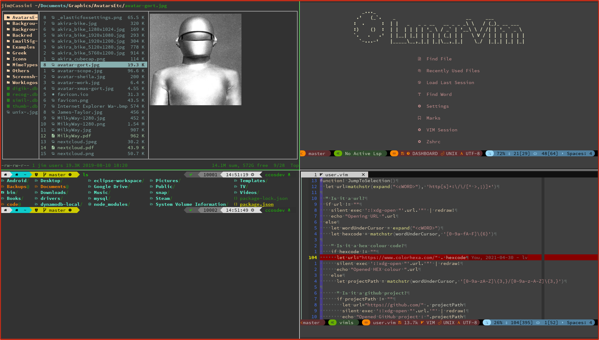
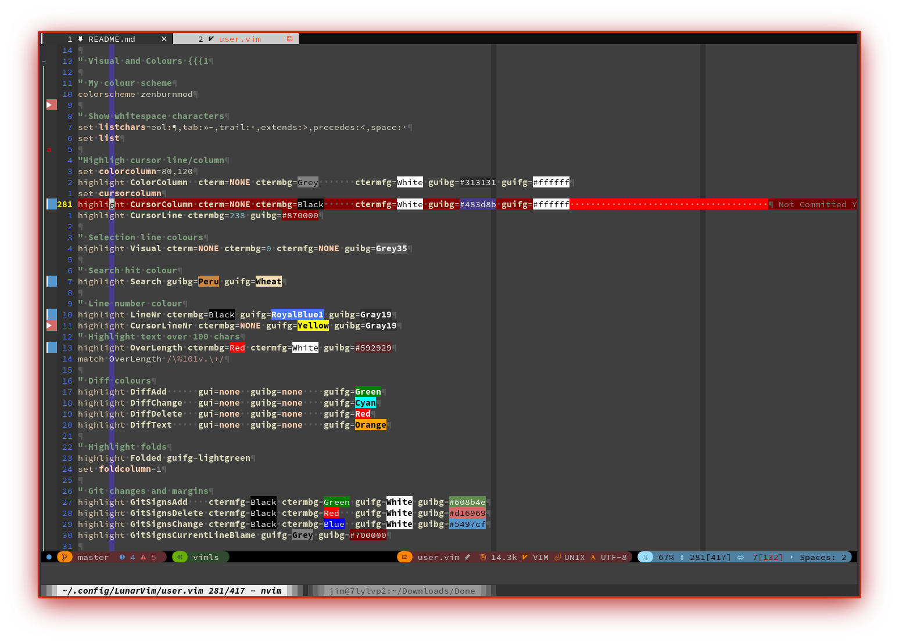
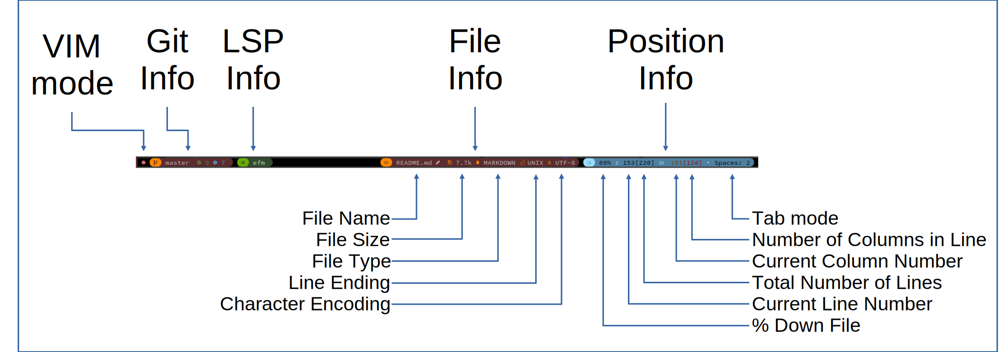
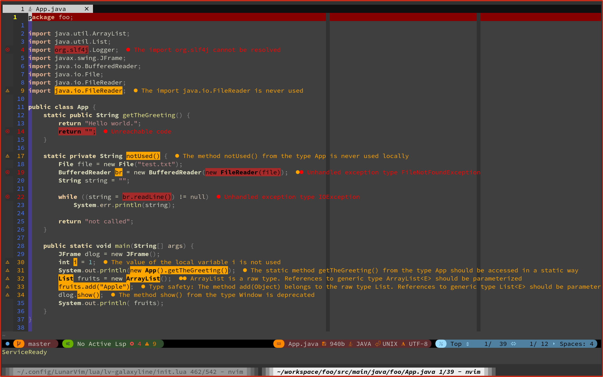

```
   _..._
 .'   (_`.    _                         __     ___
:  .      :  | |   _   _ _ __   __ _ _ _\ \   / (_)_ __ ___
:)    ()  :  | |  | | | | '_ \ / _` | '__\ \ / /| | '_ ` _ \
`.   .   .'  | |__| |_| | | | | (_| | |   \ V / | | | | | | |
  `-...-'    |_____\__,_|_| |_|\__,_|_|    \_/  |_|_| |_| |_|
```

<!-- Sheilds -->
<!-- {{{1 -->
[](https://github.com/jimcornmell/LunarVim/blob/master/LICENSE)
[](https://github.com/jimcornmell/lunarvim)
[](http://makeapullrequest.com)
[](https://JimsCosmos.com)
<!-- }}}1 -->

<!-- Main Image -->
<!-- {{{1 -->

<!-- }}}1 -->

<!-- Introduction -->
<!-- {{{1 -->

This is a fork of the **brilliant** configuration project
[LunarVim](https://github.com/ChristianChiarulli/LunarVim) by [Christian
Chiarulli](https://twitter.com/intent/follow?screen_name=chrisatmachine).
I've been using VI on and off as my daily editor since the early 1990's and
Christian's setup is the best I've seen so I've just plagiarized it and added a
few of my own twists.

The main changes are documented below:

- My config for GalaxyLine.
- My dashboard.
- Custom Keybindings.
- Custom Colours.

Most of my configuration is contained in `user.vim`.

I intend to merge Christian's changes into my config regularly to keep up with
his brilliant work.

If your interested my website is [](https://JimsCosmos.com)


<!-- }}}1 -->

# Contents
<!-- {{{1 -->
- [Visual Appearance](#visual-appearance)
- [Galaxy Line](#galaxy-line)
- [Extra Plugins](#extra-plugins)
- [Java LSP Install](#java-lsp-install)
- [Key Bindings](#key-bindings)
- [Some Useful Links](#some-useful-links)
<!-- }}}1 -->

# Visual Appearance
<!-- {{{1 -->

- I use zenburn theme.  One of the reasons for this is that its available in virtually
  any plugin/app/program that allows themeing, so I can near consistent code themeing
  everywhere.
- I've added vertical markers at 80 and 120 characters.
  - Galaxy line displays the current column and line length, these change colour at 80 and 120 characters.
- The current cursor line is highlighted in red, #605555
- The current cursor column is highlighted in light blue, #483d8b.
- Whitespace at the end of a line in highlighted in bright Red.
- Margin:
  - Current line number is highlighted in Yellow.
  - Relative line numbers are shown in RoyalBlue1.
  - Markers are shown.
  - Git changes are shown.
  - Folding marks are also shown in the margin.
<!-- }}}1 -->

# Galaxy line
<!-- {{{1 -->
The Galaxy line configuration can be found [here](https://github.com/jimcornmell/LunarVim/blob/master/lua/lv-galaxyline/init.lua).
This image shows what is in the different sections.



The line is split into 5 main sections, 3 on the left and 2 on the right:

- On the left:
  - VIM Mode is colour coded, see the init.lua for details
  - Git information
  - LSP information
- On the right:
  - File information
  - Position information
<!-- }}}1 -->

# Java LSP Install
<!-- {{{1 -->

Note Java is not stable at the moment but it looks like there is plenty of
activity, so I guess sometime in 2021 it will reach a tipping point.



1) Download and Install Java 11

At the time of writing 1/May/2021 you must use Java 11, __Java 16 will not
work.__ I have not investigated why, it was just simpler to follow the
instructions (and leave that research for someone who has the time).

```bash
# Download
wget https://corretto.aws/downloads/latest/amazon-corretto-11-x64-linux-jdk.tar.gz

# Untar
tar zxvf amazon-corretto-11-x64-linux-jdk.tar.gz

# Move to /opt
sudo mv amazon-corretto-11.0.11.9.1-linux-x64 /opt

# Create a nice link
sudo ln -s /opt/amazon-corretto-11.0.11.9.1-linux-x64 /opt/java-11
```

2) Setup your environment
```bash
export JAVA_HOME=/opt/java-11
export PATH=$PATH:$JAVA_HOME/bin
```

3) Install the LSP for Java

Full instructions are [here](https://github.com/eclipse/eclipse.jdt.ls) but the
condensed instructions are as follows.

4) Clone the repo and build

See [these instructions](https://github.com/mfussenegger/nvim-jdtls).
This took a while on my machine (10 minutes on Ryzen 7 3700X @ 3.600GHz)

```bash
git clone git@github.com:eclipse/eclipse.jdt.ls.git
cd eclipse.jdt.ls
./mvnw clean verify
cd ..
sudo mv eclipse.jdt.ls /opt
```

5) Create startup file
This must be and executable called `java-linux-ls` in a folder on your path.

```bash
#!/usr/bin/env bash
export JAVA_HOME="/opt/java-11"
export JAR="/opt/eclipse.jdt.ls/org.eclipse.jdt.ls.product/target/repository/plugins/org.eclipse.equinox.launcher_*.jar"
export JDTLS_CONFIG="/opt/eclipse.jdt.ls/org.eclipse.jdt.ls.product/target/repository/config_linux"
export WORKSPACE="$HOME/workspace"

$JAVA_HOME/bin/java \
  -Declipse.application=org.eclipse.jdt.ls.core.id1 \
  -Dosgi.bundles.defaultStartLevel=4 \
  -Declipse.product=org.eclipse.jdt.ls.core.product \
  -Dlog.protocol=true \
  -Dlog.level=ALL \
  -Xms1g \
  -Xmx2G \
  -jar           $(echo "$JAR") \
  -configuration "$JDTLS_CONFIG" \
  -data          "$WORKSPACE" \
  --add-modules=ALL-SYSTEM \
  --add-opens java.base/java.util=ALL-UNNAMED \
  --add-opens java.base/java.lang=ALL-UNNAMED
```

6) Update [`init.lua`](https://github.com/jimcornmell/LunarVim/blob/master/init.lua)
```lua
require('lsp.java-ls')
```

7) Update [`lua/plugins.lua`](https://github.com/jimcornmell/LunarVim/blob/master/lua/plugins.lua)
```lua
use {"mfussenegger/nvim-jdtls", opt = true}
require_plugin("nvim-jdtls")
```

8) Close and open LunarVim and run `:PackerSync`
<!-- }}}1 -->

# Extra Plugins
<!-- {{{1 -->
I've added a few extra plugins I use to the configuration:

- [NVim Colorizer](https://github.com/norcalli/nvim-colorizer.lua)
  - A high-performance color highlighter for Neovim which has no external dependencies! Written in performant Luajit.
- [Vim Signature](https://github.com/kshenoy/vim-signature)
  - A plugin to place, toggle and display marks.
- [Tagbar](https://github.com/preservim/tagbar)
  - A plugin that provides an easy way to browse the tags of the current file and get an overview of the files structure.
  - Opened with <kbd>F11</kbd>
- [Vim Eunuch](https://github.com/tpope/vim-eunuch)
  - Vim sugar for the UNIX shell commands that need it the most.
  - Also makes files starting with `#!` executable.
- [Vim Surround](https://github.com/tpope/vim-surround)
  - Surround.vim is all about "surroundings": parentheses, brackets, quotes,
    XML tags, and more. The plugin provides mappings to easily delete, change and add such surroundings in pairs.
- [Java LSP](https://github.com/mfussenegger/nvim-jdtls)
  - See [Java LSP Install](#java-lsp-install)
<!-- }}}1 -->

# Key Bindings
<!-- {{{1 -->

The following are a mixture of stadard key bindings and my own, which I find
useful like <kbd>Q</kbd>, <kbd>g</kbd><kbd>j</kbd>, <kbd>Alt</kbd>+<kbd>Up</kbd> etc. I've marked mine and other non-default
key-bindings with :heavy_check_mark: in the table below.

Key                                          | Bespoke          | Action
-------------------------------------------: | :--------------: | -------------------------------
<kbd>Ctrl</kbd>+<kbd>l</kbd>                 |:heavy_check_mark:| Redraws the screen and removes any search highlighting
<kbd>Ctrl</kbd>+<kbd>s</kbd>                 |:heavy_check_mark:| Save the current file.
<kbd>g</kbd><kbd>r</kbd>                     |:heavy_check_mark:| Run line under cursor in shell, **USE WITH CARE!**
<kbd>Alt</kbd>+<kbd>r</kbd>                  |:heavy_check_mark:| Run the current file.
<kbd>Alt</kbd>+<kbd>e</kbd>                  |:heavy_check_mark:| Make the current file executable `chmod a+x file`<br/>The Eunuch plugin also makes files starting with `#!` executable.
__Macros__
<kbd>q</kbd><kbd>q</kbd>                     |:x:               | Record macro (as q), you can use `qa` to record to `a` but double q is a quick shortcut.
<kbd>q</kbd>                                 |:x:               | Quit recording current macro.
<kbd>Q</kbd>                                 |:heavy_check_mark:| Play macro q, shortcut for `@q`.
__Jump__
<kbd>g</kbd><kbd>j</kbd>                     |:heavy_check_mark:| If line contains a url jump to this in browser.<br/> - Else if line contains a hex colour, `#AABBCC`jump to that colour on [ColorHexa.com](https://www.colorhexa.com)<br/>- Else if line contains a github project name of the format  `user/repository` then jump to this GitHub project.<br/>- Else if try and open the current word in [cheat.sh](https://cheat.sh) uses the buffers language to help get the right command.
__Commenting__
<kbd>Ctrl</kbd>+<kbd>/</kbd>                 |:heavy_check_mark:| (un)Comment a line and move to the next.<br/> - I've tweaked the commenter to comment the currentline (or uncomment) and then move to the next.  <br/> - I find this really handy!
__Moving Line__
<kbd>Alt</kbd>+<kbd>Up</kbd>                 |:heavy_check_mark:| Move current line up.
<kbd>Alt</kbd>+<kbd>Down</kbd>               |:heavy_check_mark:| Move current line down.
__Changing case__
<kbd>g</kbd><kbd>\~</kbd><kbd>\~</kbd>       |:x:               | Togglecase line
<kbd>g</kbd><kbd>u</kbd><kbd>u</kbd>         |:x:               | Lowercase line
<kbd>g</kbd><kbd>U</kbd><kbd>U</kbd>         |:x:               | Uppercase line
<kbd>g</kbd><kbd>~</kbd><kbd>movement</kbd>  |:x:               | Togglecase, movement is <kbd>w</kbd> or <kbd>}</kbd> etc.
<kbd>g</kbd><kbd>u</kbd><kbd>movement</kbd>  |:x:               | Lowercase
<kbd>g</kbd><kbd>U</kbd><kbd>movement</kbd>  |:x:               | Uppercase
&nbsp;                                       |:x:               | Title Case regex `:s/\<\(\w\)\(\w\*\)\>/\u\1\L\2/g`
__Marks__
<kbd>m</kbd><kbd>/</kbd>                     |:x:               | Display marks.
<kbd>m</kbd><kbd>space</kbd>                 |:x:               | Remove all marks.
<kbd>m</kbd><kbd>x</kbd>                     |:x:               | Toggle mark <kbd>x</kbd>
<kbd>'</kbd><kbd>x</kbd>                     |:x:               | Goto to mark <kbd>x</kbd>
__Increment a value__
<kbd>Ctrl</kbd>+<kbd>a</kbd>                 |:x:               | Increment value under cursor by 1.  Also works with Dates/times....
<kbd>Ctrl</kbd>+<kbd>x</kbd>                 |:x:               | Decrement value under cursor by 1.<br/>`:let i=1 \| g/foo/s//\=i/ \| let i=i+1`<br/>`:let i=1 \| g/foo/s//\="morestuff".i."morestuff"/ \| let i=i+1`
__Other misc commands__
<kbd>d</kbd><kbd>t</kbd><kbd>char</kbd>      |:x:               | Delete to `char`.
<kbd>d</kbd><kbd>^</kbd>                     |:x:               | Delete to start of line.
<kbd>D</kbd>                                 |:x:               | Delete to end of line.
<kbd>g</kbd><kbd>a</kbd>                     |:x:               | Ascii, octal val of char under cursor.
<kbd>c</kbd><kbd>a</kbd><kbd>t</kbd>, <kbd>c</kbd><kbd>i</kbd><kbd>t</kbd>           |:x:               | etc for change insert tags etc.
<kbd>c</kbd><kbd>i</kbd><kbd>'</kbd>, <kbd>c</kbd><kbd>a</kbd><kbd>(</kbd>, <kbd>c</kbd><kbd>i</kbd><kbd>{</kbd>      |:x:               | Change stuff in between ' (also works for ", [, (, {).
<kbd>c</kbd><kbd>c</kbd>                     |:x:               | Change current line.
<kbd>c</kbd><kbd>f</kbd><kbd>char</kbd>      |:x:               | Change to `char` (any char).
<kbd>tab</kbd>, <kbd>shift</kbd>+<kbd>tab</kbd>, <kbd>b</kbd><kbd>d</kbd>    |:x:               | Buffer next, previous, delete (close).
<kbd>g</kbd><kbd>d</kbd>                     |:x:               | Goto definition.
__Formatting__
<kbd>g</kbd><kbd>g</kbd><kbd>=</kbd><kbd>G</kbd> |:x:           | auto (re)indent entire document.
<kbd>=</kbd>                                 |:x:               | (re)indent the text on the current line or on the area selected (SUPER).
<kbd>=</kbd><kbd>%</kbd>                     |:x:               | (re)indent the current braces { ... }.
`:%!par`                                     |:x:               | Format range, in this case whole doument.
`:%!par j1w80`                               |:x:               | Format range to j1w80.
<kbd>Ctrl</kbd>+<kbd>w</kbd>                 |:heavy_check_mark:| Wrap, quick format current paragraph.
&nbsp;                                       |:x:               | `:[range]ce[nter] [width] center lines :.,+3 center 80`
&nbsp;                                       |:x:               | `:[range] ri[ght] [right edge] right alignment :% right`
&nbsp;                                       |:x:               | `:[range] le[ft] [indent] left alignment.(Unit of identation is space) :% left 4`
__Block editing__
<kbd>Ctrl</kbd>+<kbd>q</kbd>                 |:x:               | Start column mode<br/>Select the columns and rows where you want to enter your text, shift and move with keyboard ('''Do not use the mouse to select the block!''')
<kbd>I</kbd>                                 |:x:               | To go into insert mode in column mode.<br/>Type in the text you want to enter. Don't be discouraged by the fact that only the first row is changed.
<kbd>Esc</kbd>                               |:x:               | To apply your change (or alternately <kbd>Ctrl</kbd>+<kbd>c</kbd>)
__Surround__
<kbd>c</kbd><kbd>s</kbd><kbd>"</kbd><kbd>'</kbd> |:heavy_check_mark:| "aWord" to 'aWord'
<kbd>c</kbd><kbd>s</kbd><kbd>'</kbd><kbd>"</kbd> |:heavy_check_mark:| 'aWord' to "aWord"
<kbd>c</kbd><kbd>s</kbd><kbd>'</kbd><kbd>&lt;</kbd><kbd>q</kbd><kbd>&gt;</kbd>  | :heavy_check_mark: | 'aWord' to &lt;q&gt;aWord&lt;/q&gt;
<kbd>d</kbd><kbd>s</kbd><kbd>'</kbd>             |:heavy_check_mark:| 'aWord' to aWord
<kbd>y</kbd><kbd>s</kbd><kbd>i</kbd><kbd>w</kbd><kbd>]</kbd> |:heavy_check_mark:| aWord to [aWord]
<kbd>y</kbd><kbd>s</kbd><kbd>s</kbd><kbd>)</kbd> |:heavy_check_mark:| Whole-Line to (Whole-Line)
<kbd>y</kbd><kbd>s</kbd><kbd>s</kbd><kbd>"</kbd> |:heavy_check_mark:| Whole-Line to "Whole-Line"
__Eunuch__
SudoWrite |&nbsp;" | Write even if you don't have permission.
__Repeat__
Not tested yet | &nbsp; | Todo
__Function Keys__
<kbd>F1</kbd>                                |:heavy_check_mark:| Help, open this page
<kbd>F2</kbd>                                |:heavy_check_mark:| Cycle through different folding methods.
<kbd>F4</kbd>                                |:heavy_check_mark:| Open left file menu
<kbd>F9</kbd>                                |:heavy_check_mark:| Open Telescope
<kbd>F10</kbd>                               |:heavy_check_mark:| Kitty command - New terminal in new tab
<kbd>F11</kbd>                               |:heavy_check_mark:| Toggle right tagbar
<kbd>F12</kbd>                               |:heavy_check_mark:| Toggle ranger
__Misc commands__
`:set number!`                               |:x:               | Toggle line numbers.
`:set relativenumber!`                       |:x:               | Toggle relative line numbers.
`:set ft={markdown\|java\|...}`              |:x:               | Set file type.
`:set ff={unix\|html\|dos}`                  |:x:               | Set file format.
`:set syntax?`                               |:x:               | Syntax type.
<!-- }}}1 -->

# Some Useful Links
<!-- {{{1 -->
| [](https://neovim.io) | [](https://github.com/ChristianChiarulli/LunarVim) | [](http://vimsheet.com)
| :--: | :--: | :--:
| [](https://www.cheatsheet.wtf/vim/) | [](http://tnerual.eriogerg.free.fr/vimqrc.html) | [](https://paulgorman.org/technical/vim.html)
| [](https://catswhocode.com/vim-commands/) | [](https://www.openvim.com/) | [](http://www.oualline.com/vim-cook.html)
| [](https://vimawesome.com) | &nbsp; | &nbsp;
<!-- }}}1 -->

<!--
TODO: https://github.com/tpope/vim-repeat
-->
