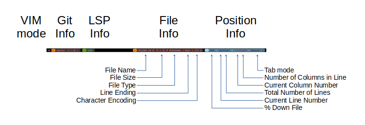

```
   _..._
 .'   (_`.    _                         __     ___
:  .      :  | |   _   _ _ __   __ _ _ _\ \   / (_)_ __ ___
:)    ()  :  | |  | | | | '_ \ / _` | '__\ \ / /| | '_ ` _ \
`.   .   .'  | |__| |_| | | | | (_| | |   \ V / | | | | | | |
  `-...-'    |_____\__,_|_| |_|\__,_|_|    \_/  |_|_| |_| |_|
```

<!-- Christian Information -->
<!-- {{{1 -->
[](https://github.com/ChristianChiarulli/LunarVim/blob/master/LICENSE)
[](https://github.com/ChristianChiarulli/lunarvim)
[](http://makeapullrequest.com)
<a href="https://patreon.com/chrisatmachine" title="Donate to this project using Patreon"></a>
<a href="https://twitter.com/intent/follow?screen_name=chrisatmachine"></a>
<!-- }}}1 -->

<!-- Main Image -->
<!-- {{{1 -->

<!-- }}}1 -->

<!-- Introduction -->
<!-- {{{1 -->

This is a fork of the **brilliant** configuration project
[LunarVim](https://github.com/ChristianChiarulli/LunarVim) by [Christian
Chiarulli](https://twitter.com/intent/follow?screen_name=chrisatmachine).
I've been using VI on and off as my daily editor since the early 1990's and
Christian's setup is the best I've seen so I've just plagiarized it and added a
few of my own twists.

The main changes are documented below:

- My config for GalaxyLine.
- My dashboard.
- Custom Keybindings.

Most of my configuration is contained in ```user.vim```.

I intend to merge Christian's changes into my config regularly to keep up with
his brilliant work.

<!-- }}}1 -->

# Contents
<!-- {{{1 -->
- [Some Useful Links](#some-useful-links)
- [Extra Plugins](#extra-plugins)
- [Key Bindings](#key-bindings)
- [Visual Appearance](#visual-appearance)
- [Galaxy Line](#galaxy-line)
- [Forgotten Commands](#forgotten-commands)
<!-- }}}1 -->

# Some Useful Links
  <!-- {{{1 -->
- [NeoVim](https://neovim.io)
- [LunarVim](https://github.com/ChristianChiarulli/LunarVim)
- [Vim Sheet](http://vimsheet.com)
- [Quick ref](http://tnerual.eriogerg.free.fr/vimqrc.html)
- [Cheatsheet](https://paulgorman.org/technical/vim.html)
- [100 Essential commands](https://catswhocode.com/vim-commands/)
- [Vim tutorial](https://www.openvim.com/)
- [Vim cookbook](http://www.oualline.com/vim-cook.html)
<!-- }}}1 -->

# Extra Plugins
<!-- {{{1 -->
I've added a few extra plugins I use to the configuration:

- [NVim Colorizer](https://github.com/norcalli/nvim-colorizer.lua)
  - A high-performance color highlighter for Neovim which has no external dependencies! Written in performant Luajit.
- [Vim Signature](https://github.com/kshenoy/vim-signature)
  - A plugin to place, toggle and display marks.
- [Tagbar](https://github.com/preservim/tagbar)
  - A plugin that provides an easy way to browse the tags of the current file and get an overview of the files structure.
  - Opened with ```<F11>```
- [Vim Eunuch](https://github.com/tpope/vim-eunuch)
  - Vim sugar for the UNIX shell commands that need it the most.
- [Vim Surround](https://github.com/tpope/vim-surround)
  - Surround.vim is all about "surroundings": parentheses, brackets, quotes,
    XML tags, and more. The plugin provides mappings to easily delete, change and add such surroundings in pairs.
<!-- }}}1 -->

# Key Bindings
<!-- {{{1 -->

The following are a mixture of stadard key bindings and my own, which I find
useful like ```Q```, ```gj```, ```<Alt-Up>``` etc.

Key                                    | Action
-------------------------------------- | ---------------------------------
```<Ctrl-w>```                         | Format paragraph to at most 79 chars.
```<Ctrl-l>```                         | redraws the screen and removes any search highlighting
```gr```                               | Run line under cursor in shell, **USE WITH CARE!**
__Macros__
```qq```                               | Record (as q).
```q```                                | Quit recording.
```Q```                                | Play macro q.
__Jump__
```gj```                               | If line contains a url jump to this in browser.<br/> - Else if line contains a hex colour, ```#AABBCC```jump to that colour on [ColorHexa.com](https://www.colorhexa.com)<br/>- Else if line contains a github project name of the format  ```user/repository``` then jump to this GitHub project.<br/>- Else if try and open the current word in [cheat.sh](https://cheat.sh) uses the buffers language to help get the right command.
__Commenting__
```<Ctrl-/>```                         | (un)Comment a line and move to the next.<br/> - I've tweaked the commenter to comment the currentline (or uncomment) and then move to the next.  <br/> - I find this really handy!
__Moving Line__
```<Alt-Up>```                         | Move current line up.
```<Alt-Down>```                       | Move current line down.
__Changing case__
```g~~```                              | Togglecase line
```guu```                              | Lowercase line
```gUU```                              | Uppercase line
```g~<movement>```                     | Togglecase, movement is ```w``` or ```}``` etc.
```gu<movement>```                     | Lowercase
```gU<movement>```                     | Uppercase
&nbsp;                                 | Title Case regex ```:s/\<\(\w\)\(\w\*\)\>/\u\1\L\2/g```
__Marks__
```m/```                               | Display marks.
```m<space>```                         | Remove all marks.
```mx```                               | Toggle mark 'x'
```'x```                               | Goto to mark 'x'
__Increment a value__
```<Ctrl+a>```                         | Increment value under cursor by 1.
```<Ctrl+x>```                         | Decrement value under cursor by 1.
&nbsp;                                 | ```:let i=1 \| g/foo/s//\=i/ \| let i=i+1```
&nbsp;                                 | ```:let i=1 \| g/foo/s//\="morestuff".i."morestuff"/ \| let i=i+1```
__Other misc commands__
```dt<char>```                         | Delete to ```char```.
```d^```                               | Delete to start of line.
```D```                                | Delete to end of line.
```ga```                               | Ascii, octal val of char under cursor.
```cat```, ```cit```                   | etc for change insert tags etc.
```ci'``` ```ca(``` ```ci{```          | Change stuff in between ' (also works for ", [, (, {).
```cc```                               | Change current line.
```cf<char>```                         | Change to ```char``` (any char).
```bn``` or ```<tab>```, ```bp``` or ```<shift+tab>```, ```bd```                                  | buffer next, previous, delete (close).
```gd```                               | Goto definition.
__Formatting__
```gg=G```                             | auto (re)indent entire document.
```=```                                | (re)indent the text on the current line or on the area selected (SUPER).
```=%```                               | (re)indent the current braces { ... }.
```:%!par```                           | Format range, in this case whole doument.
```:%!par j1w80```                     | Format range to j1w80.
```<Ctrl-w>```                         | Wrap, quick format current paragraph.
&nbsp;                                 | ```:[range]ce[nter] [width] center lines :.,+3 center 80```
&nbsp;                                 | ```:[range] ri[ght] [right edge] right alignment :% right```
&nbsp;                                 | ```:[range] le[ft] [indent] left alignment.(Unit of identation is space) :% left 4```
__Block editing__
```<Ctrl+q>```                         | Start column mode
&nbsp;                                 | Select the columns and rows where you want to enter your text, shift and move with keyboard ('''Do not use the mouse to select the block!''')
```I```                                | To go into insert mode in column mode.
&nbsp;                                 | Type in the text you want to enter. Don't be discouraged by the fact that only the first row is changed.
```Esc```                              | To apply your change (or alternately ```<Ctrl+c>```)
__Function Keys__
```<F1>```                             | Help, open this page
```<F2>```                             | Toggle highlighting whitespace at end of line
```<F3>```                             | Toggle whitespace highlight
```<F4>```                             | Open left file menu
```<F5>```                             | Special binding for kitty, not used in vim
```<F6>```                             | Toggle line wrap
```<F7>```                             | Toggle spell check highlighting
```<F8>```                             | Not defined
```<F9>```                             | Open Telescope
```<F10>```                            | New terminal in Kitty in new tab
```<F11>```                            | Toggle right tagbar
```<F12>```                            | Toggle ranger
__Script Header__
```#!ba```                             | in normal mode and the bash file header will be inserted, also makes the file executable.
```#!sh```                             | Shell
```#!pe```                             | Perl
```#!py```                             | Python
```#!gr```                             | Groovy
```#!zs```                             | Zsh
__Misc commands__
```:set number!```                     | Toggle line numbers.
```:set ft={markdown\|java|...}```     | Set file type.
```:set ff={unix\|html\|dos}```        | Set file format.
```:set syntax?```                     | Syntax type.
<!-- }}}1 -->

# Visual Appearance
<!-- {{{1 -->

- I use zenburn theme.  One of the reasons for this is that its available in virtually
  any plugin/app/program that allows themeing, so I can near consistent code themeing
  everywhere.
- I've added vertical markers at 80 and 120 characters.
  - Galaxy line displays the current column and line length, these change colour at 80 and 120 characters.
- The current cursor line is highlighted in red, #870000
- The current cursor column is highlighted in light blue, #483d8b.
- Whitspace at the end of a line in highlighted in bright Red.
- Margin:
  - Current line number is highlighted in Yellow.
  - Relative line numbers are shown in RoyalBlue1.
  - Markers are shown.
  - Git changes are shown.
  - Folding marks are also shown in the margin.
<!-- }}}1 -->

# Galaxy line
<!-- {{{1 -->
The Galaxy line configuration can be found [here](https://github.com/jimcornmell/LunarVim/blob/master/lua/lv-galaxyline/init.lua).
This image shows what is in the different sections.



The line is split into 5 main sections, 3 on the left and 2 on the right:

- On the left:
  - VIM Mode is colour coded, see the init.lua for details
  - Git information
  - LSP information
- On the right:
  - File information
  - Position information
<!-- }}}1 -->

<!-- # Todo -->
<!-- {{{1 -->
<!-- }}}1 -->
