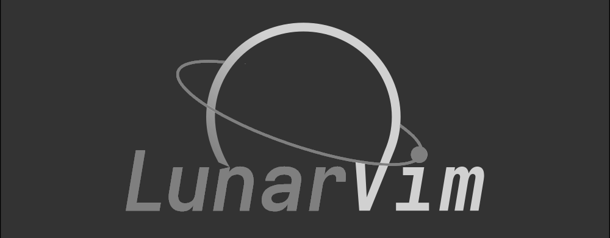
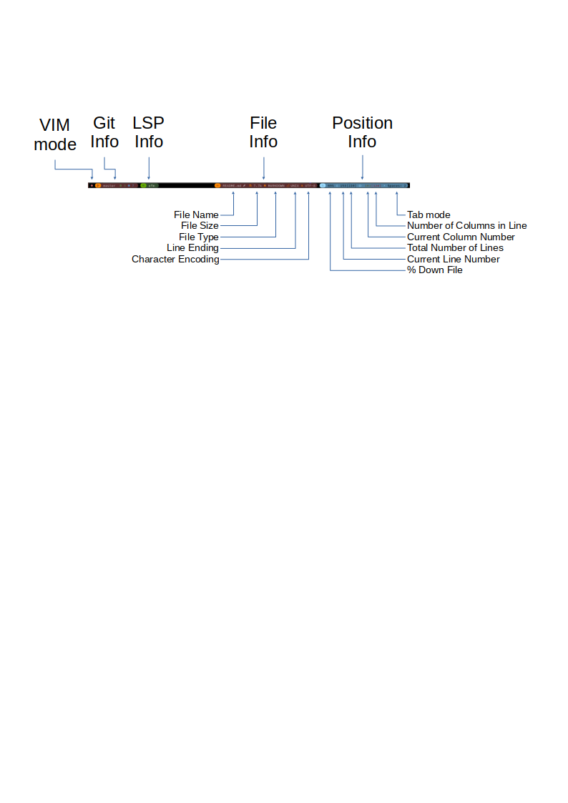
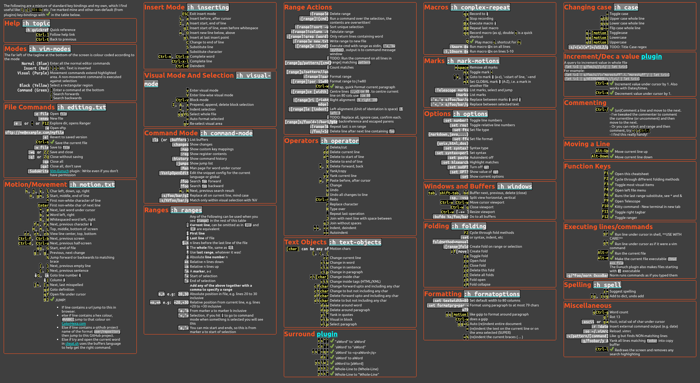

<!-- Sheilds -->
<!-- {{{1 -->

[](https://github.com/jimcornmell/LunarVim/blob/master/LICENSE)
[](https://github.com/jimcornmell/lunarvim)
[](http://makeapullrequest.com)
[](https://JimsCosmos.com)

<!-- }}}1 -->

<!-- Main Image -->
<!-- {{{1 -->




<!-- }}}1 -->

<!-- Introduction -->
<!-- {{{1 -->

This is a fork of the **brilliant** configuration project
[LunarVim](https://github.com/ChristianChiarulli/LunarVim) by [Christian
Chiarulli](https://twitter.com/intent/follow?screen_name=chrisatmachine).
I've been using VI on and off as my daily editor since the early 1990's and
Christian's setup is the best I've seen so I've just plagiarized it and added a
few of my own twists.

The main changes are documented below:

- My config for GalaxyLine.
- My dashboard.
- Custom Keybindings.
- Custom Colours.

Most of my configuration is contained in `user.vim`.

I intend to merge Christian's changes into my config regularly to keep up with
his brilliant work.

<<<<<<< HEAD
If your interested my website is [](https://JimsCosmos.com)

<!-- }}}1 -->

# Contents

<!-- {{{1 -->

- [Visual Appearance](#visual-appearance)
- [Galaxy Line](#galaxy-line)
- [Extra Plugins](#extra-plugins)
- [Java LSP Install](#java-lsp-install)
- [Key Bindings](#key-bindings)
- [Some Useful Links](#some-useful-links)
<!-- }}}1 -->

# Visual Appearance

<!-- {{{1 -->


- I use zenburn theme. One of the reasons for this is that its available in virtually
  any plug-in/app/program that allows theming, so I can near consistent code theming
  everywhere.
- I've added vertical markers at 80 and 120 characters.
  - Galaxy line displays the current column and line length, these change colour at 80 and 120 characters.
- The current cursor line is highlighted in red, #605555
- The current cursor column is highlighted in light blue, #483d8b.
- Whitespace at the end of a line in highlighted in bright Red.
- Margin:
  - Current line number is highlighted in Yellow.
  - Relative line numbers are shown in RoyalBlue1.
  - Markers are shown.
  - Git changes are shown.
  - Folding marks are also shown in the margin.
  <!-- }}}1 -->

# Galaxy line

<!-- {{{1 -->

The Galaxy line configuration can be found [here](https://github.com/jimcornmell/LunarVim/blob/master/lua/lv-galaxyline/init.lua).
This image shows what is in the different sections.



The line is split into 5 main sections, 3 on the left and 2 on the right:

- On the left:
  - VIM Mode is colour coded, see the init.lua for details
  - Git information
  - LSP information
- On the right:
  - File information
    - Line Ending, Linux , Mac  or Windows 
    - File Name
    - File Type
    - File Size
    - Character encoding
  - Position information - Percentage - Current Line Number / Number of lines in the file - Current column / length of current line - Tab mode,  or  and number of characters
  Note the column information is colour coded, >80 = Yellow >120 = Red.
  <!-- }}}1 -->

# Java LSP Install

<!-- {{{1 -->
=======
```lua
-- O is the global options object

-- THESE ARE EXAMPLE CONFIGS FEEL FREE TO CHANGE TO WHATEVER YOU WANT
-- general
O.auto_complete = true
O.relative_number = false
O.colorscheme = 'spacegray'
O.timeoutlen = 100
O.leader_key = ' '

-- After changing plugin config it is recommended to run :PackerCompile
O.plugin.hop.active = true
O.plugin.colorizer.active = true
O.plugin.trouble.active = true
O.plugin.lazygit.active = true
O.plugin.zen.active = true
O.plugin.markdown_preview.active = true

-- if you don't want all the parsers change this to a table of the ones you want
O.treesitter.ensure_installed = "all"
O.treesitter.ignore_install = {"haskell"}
O.treesitter.highlight.enabled = true

-- lua
O.lang.lua.autoformat = false
O.lang.lua.formatter = 'lua-format'

-- javascript
O.lang.tsserver.formatter = 'prettier'
O.lang.tsserver.linter = nil
O.lang.tsserver.autoformat = true

-- json
O.lang.json.autoformat = true

-- Additional Plugins
-- O.user_plugins = {{"windwp/nvim-ts-autotag"}}

-- Autocommands (https://neovim.io/doc/user/autocmd.html)
-- O.user_autocommands = {{ "BufWinEnter", "*", "echo \"hi again\""}}

-- Additional Leader bindings for WhichKey
-- O.user_which_key = {
--   A = {
--     name = "+Custom Leader Keys",
--     a = { "<cmd>echo 'first custom command'<cr>", "Description for a" },
--     b = { "<cmd>echo 'second custom command'<cr>", "Description for b" },
--   },
-- }
```
>>>>>>> cd7da503505d6707fbe9f674e8b75fed00f1e690

Note Java is not stable at the moment but it looks like there is plenty of
activity, so I guess sometime in 2021 it will reach a tipping point.


1. Download and Install Java 11

At the time of writing 1/May/2021 you must use Java 11, **Java 16 will not
work.** I have not investigated why, it was just simpler to follow the
instructions (and leave that research for someone who has the time).

```bash
# Download
wget https://corretto.aws/downloads/latest/amazon-corretto-11-x64-linux-jdk.tar.gz

# Untar
tar zxvf amazon-corretto-11-x64-linux-jdk.tar.gz

# Move to /opt
sudo mv amazon-corretto-11.0.11.9.1-linux-x64 /opt

# Create a nice link
sudo ln -s /opt/amazon-corretto-11.0.11.9.1-linux-x64 /opt/java-11
```

2. Setup your environment

```bash
export JAVA_HOME=/opt/java-11
export PATH=$PATH:$JAVA_HOME/bin
```

3. Install the LSP for Java

Full instructions are [here](https://github.com/eclipse/eclipse.jdt.ls) but the
condensed instructions are as follows.

4. Clone the repo and build

See [these instructions](https://github.com/mfussenegger/nvim-jdtls).
This took a while on my machine (10 minutes on Ryzen 7 3700X @ 3.600GHz)

```bash
git clone git@github.com:eclipse/eclipse.jdt.ls.git
cd eclipse.jdt.ls
./mvnw clean verify
cd ..

sudo mv eclipse.jdt.ls /opt
```

5. Create startup file
   This must be and executable called `java-linux-ls` in a folder on your path.

```bash
#!/usr/bin/env bash
export JAVA_HOME="/opt/java-11"
export JAR="/opt/eclipse.jdt.ls/org.eclipse.jdt.ls.product/target/repository/plugins/org.eclipse.equinox.launcher_*.jar"
export JDTLS_CONFIG="/opt/eclipse.jdt.ls/org.eclipse.jdt.ls.product/target/repository/config_linux"
export WORKSPACE="$HOME/workspace"

$JAVA_HOME/bin/java \
  -Declipse.application=org.eclipse.jdt.ls.core.id1 \
  -Dosgi.bundles.defaultStartLevel=4 \
  -Declipse.product=org.eclipse.jdt.ls.core.product \
  -Dlog.protocol=true \
  -Dlog.level=ALL \
  -Xms1g \
  -Xmx2G \
  -jar           $(echo "$JAR") \
  -configuration "$JDTLS_CONFIG" \
  -data          "$WORKSPACE" \
  --add-modules=ALL-SYSTEM \
  --add-opens java.base/java.util=ALL-UNNAMED \
  --add-opens java.base/java.lang=ALL-UNNAMED
```

6. Update [`init.lua`](https://github.com/jimcornmell/LunarVim/blob/master/init.lua)

```lua
require('lsp.java-ls')
```

7. Update [`lua/plugins.lua`](https://github.com/jimcornmell/LunarVim/blob/master/lua/plugins.lua)

```lua
use {"mfussenegger/nvim-jdtls", opt = true}
require_plugin("nvim-jdtls")
```

8. Close and open LunarVim and run `:PackerSync`
<!-- }}}1 -->

# Extra Plugins

<!-- {{{1 -->

I've added a few extra plugins I use to the configuration:

<!-- - [NVim Colorizer](https://github.com/norcalli/nvim-colorizer.lua) -->
  <!-- - A high-performance color highlighter for Neovim which has no external dependencies! Written in performant Luajit. -->

- [Vim Signature](https://github.com/kshenoy/vim-signature)
  - A plugin to place, toggle and display marks.
    <!-- - [Tagbar](https://github.com/preservim/tagbar) -->
    <!--   - A plugin that provides an easy way to browse the tags of the current file and get an overview of the files structure. -->
    <!--   - Opened with <kbd>F11</kbd> -->
- [Vim Eunuch](https://github.com/tpope/vim-eunuch)
  - Vim sugar for the UNIX shell commands that need it the most.
  - Also makes files starting with `#!` executable.
- [Vim Surround](https://github.com/tpope/vim-surround)
  - Surround.vim is all about "surroundings": parentheses, brackets, quotes,
    XML tags, and more. The plugin provides mappings to easily delete, change and add such surroundings in pairs.
    <!-- - [Java LSP](https://github.com/mfussenegger/nvim-jdtls) -->
    <!--   - See [Java LSP Install](#java-lsp-install) -->
    <!-- }}}1 -->

# Key Bindings

<!-- {{{1 -->

Note this cheatsheet is available as a HTML file, which is accessed by hitting <kbd>F1</kbd> in vim.
See my dotfiles for a simple bash script to convert this GitHut markdown file into HTML (and thus PNG).

- [Markdown Cheatsheet](cheatsheet.md)
- [HTML Cheatsheet](cheatsheet.html)
- [PNG Cheatsheet](./utils/media/cheatsheet.png)



<!-- }}}1 -->

# Some Useful Links

<!-- {{{1 -->

|                             [](https://neovim.io)                             | [](https://github.com/ChristianChiarulli/LunarVim) |             [](http://vimsheet.com)             |
| :-------------------------------------------------------------------------------------------------------------------------------------: | :------------------------------------------------------------------------------------------------------------------: | :---------------------------------------------------------------------------------------------------------------: |
|           [](https://www.cheatsheet.wtf/vim/)           |  [](http://tnerual.eriogerg.free.fr/vimqrc.html)   |  [](https://paulgorman.org/technical/vim.html)  |
| [](https://catswhocode.com/vim-commands/) |         [](https://www.openvim.com/)         | [](http://www.oualline.com/vim-cook.html) |
|                      [](https://vimawesome.com)                       |                                                        &nbsp;                                                        |                                                      &nbsp;                                                       |

<<<<<<< HEAD
<!-- }}}1 -->
=======
<<<<<<< HEAD

=======
<div align="center">
	
[]()
	
	
</div>
>>>>>>> 68bfac0468ea4d5d7faf5bede0a4ab8cb5572f0c
>>>>>>> cd7da503505d6707fbe9f674e8b75fed00f1e690
